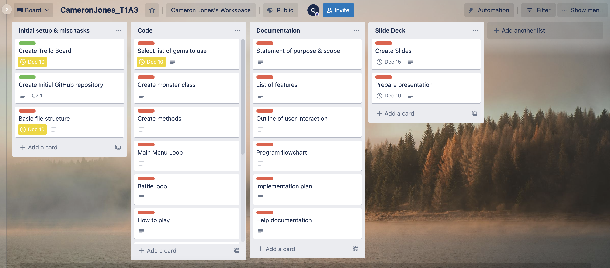
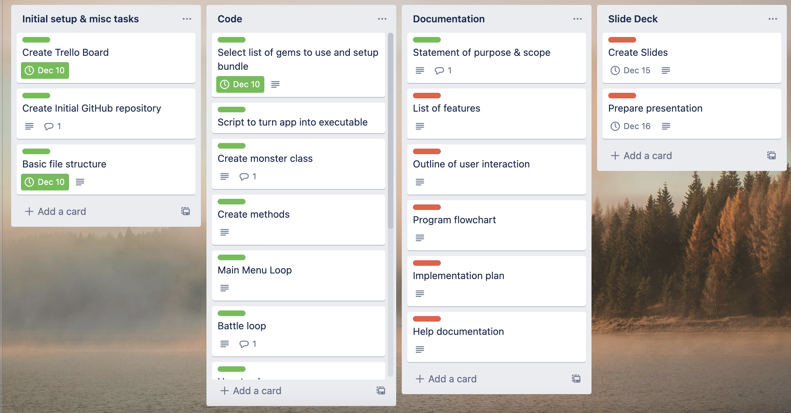
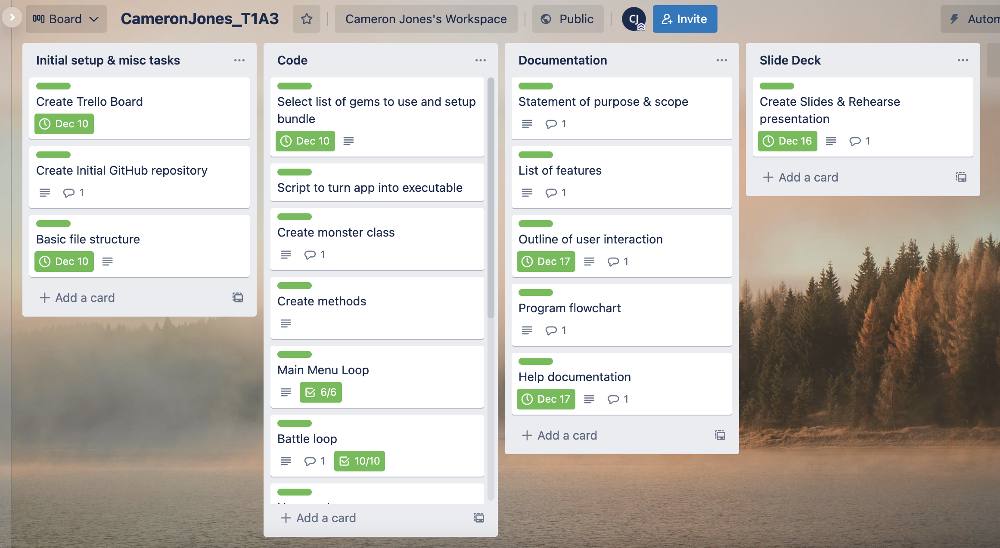

# CameronJones_T1A3

[Link to my repo](https://github.com/iamcrjones/CameronJones_T1A3)

[Link to Trello board](https://trello.com/b/agY6uh5L/cameronjonest1a3)

## Installation and Requirements

This application was built and tested using Ruby version 3.0.0 on macOS version 11.6.
If you are encountering errors with ruby, please install version 3.0.0

### Installing Ruby

You can follow a well written guide to installing Ruby by clicking [Here](https://www.ruby-lang.org/en/documentation/installation/)

### Running this application

In order to run this application, download this repository onto your computer and extract the zip file to the desired location on your drive.

From here you will open your terminal of choice and navigate to the directory and enter the folder named "src".

In your terminal, enter the command `./runme.sh` followed by a username you would like to set for yourself, followed by `Normal` or `Hard` to select your difficulty. If you do not enter a username or difficulty you will be prompted to do so as the application will not commence otherwise.

Press `Enter` to run the file and it will install everything needed by ruby to run the application and will then begin.

If you are receiving permissions errors when the script is trying to install Bundler, please enter the following command into your terminal before running the script:

`sudo gem install bundle`

This should allow the bundle gem to be installed successfully to that directory and then load the Gemfile to install everything else needed.

I hope you like my app!
## Purpose & Scope

### What the application will do:

In this application, when the user first launches the application, they will be asked to input a username for themselves. The user will not be able to enter an invalid username such as no input or white spaces. If this does occur, the program will prompt the user to enter a valid username containing at least one character be it letter, number, or symbol.

Once a valid username has been entered, the program will then loop into the main menu for the application. Here the user can choose to enter the battle simulator, view how the game works, or exit the application if they so choose.

When the option to enter battle is selected, there will be a short piece of text that will appear as if the computer is typing a message to the user stating that they cannot be defeated. The user will then be prompted to choose from one of three different monsters to use in the battle. The computer will then choose one of the three monsters at random to use against you.

The monsters will all have a name and two differently named moves. All monsters will have a maximum health of 100 for the first battle and the moves each monster knows will have the same damage across all monsters with move 1 having 10 damage, and move 2 having 15 damage.

The battle will begin by the application prompting the user to select one of the two moves to use against the opponent and then the opposing monster's health will be reduced by the amount of damage of the selected move. When a move is selected, there will be a 10% chance of the damage being a critical hit, reducing the health by an extra 10 points. The program will then move on to the computer's turn, where one of the moves will be selected at random and the same critical hit chance applied. This process will keep repeating until one side's health reaches zero or becomes less than zero.

If the user is victorious, a message will display congratulating them on their win, the computer will type a message stating that they will not be defeated next time. A win counter will then be applied to the username so if they wish to battle again without closing the application, the computer will have a different response when the battle first begins.

I am developing this application to solve the problem of boredom and also to introduce people to the very basic levels of a pokemon-style battle.

The target audience for this application is people looking for some form of entertainment in the means of a small quick game.

A member of the target audience would use this application to pass the time and also to understand the basic concept of a pokemon-style battle.

## Main features
#### Main Menu

The first feature that is within this application is the main menu. Before accessing the main menu, the user must enter a username and difficulty in order for the application to proceed. The main menu functions as case statement inside a loop once it is loaded which will be active for the entire time of the application running and will only break when the user selects "Exit" in the main menu to close the application. The main menu also contains a list of rules explaining how the game functions and the main battle feature.

The idea behind coding the main menu by calling methods is to keep the code clean and organized as it only has to run 3 methods total.

#### Battle Setup

The battle setup is the beginning of the main battle feature. It is where all of the methods regarding the monster selection process is called for the game. This includes assigning the variables of the selections of monsters and is returned in an array to then be used as the arguments for the main battle in order to keep the selections correct. The user has the ability to choose one of the three different monsters through the means of a selection prompt with TTY Prompt. This fits the old pokemon aesthetics of a Gameboy and also helps with error handling as the user only has the ability to choose from the set list as opposed to typing in a text input which can result in higher chances of user error.

#### Main Battle

Once the battle setup phase is complete, the actual battle with commence which is the main feature of this application. It is all contained within a loop as the user and the computer cycle through turns, the program checks if either side has reached zero health in order to break the loop and display a message saying wether the user has won or lost. As with majority of the application, error handling is done through the use of TTY Prompt as it prevents incorrect inputs and suits the theme of the app. If the difficulty argument is set to Hard, it multiplies the health value of the opposing monster by 1.5x, making it much more difficult as in order to win, the user must be lucky with the critical hit RNG. Afterwards the application with loop back to the main menu, giving the user the option to play the game and battle again, or to exit the application.

#### Critical Hits

Critical hits is a feature that functions behind the scenes as there isn't a way for the user to physically access this feature, it happens automatically. When either the user, or the computer chooses a move for their monster to attack with, there is a random number generator that runs and if the generated number is within a certain range, it then displays a message stating that they have landed a critical hit. If a move is a critical hit, then the damage value of the selected move is multiplied by 1.5x and then rounded to the nearest whole number with the .round method.

## Flow Diagram

## Trello Screenshots

## User interaction outline

For all of the features in this application, the user is either guided through the features, or they are happening automatically without relying upon the user.

If command line arguments have not been set by the user when running the script file, they will be prompted to do so and the application will not proceed unless they do so.

After command line arguments have been set the application then loads into the main menu. From here I have made use of TTY Prompt extensively for the use of all menu navigation which in turn eliminates mitigates all forms of user error as they are only able to select from the options provided to them.

The main menu and battle components are the main features of this application. The main menu is accessed by the user simply entering valid command line arguments and they have access to this feature. The way they find out how to use this feature is through TTY Prompt as it has the built in function of informing the user to navigate the selection with the arrow keys and pressing enter to confirm their selection.

Both the battle setup and the main part of the battle make use of the same error handling and explanation of how to interact with them as the main menu through TTY Prompt's default functions

## Credits and Ethical issues

### Use of an existing IP names

In this application I have made use of names from the Pokemon franchise which are under copyright. This application was for an assessment piece for my studies and is in no way to be used commercially under any circumstances. Any copyrighted material belongs to their respective owners.

Eventually I plan to develop this app further and will change the names to ensure that there is nothing used that belongs to any other IP.

### Credits to gem authors

TTY Prompt, Font, Cursor, Screen, and Progress Bar: https://ttytoolkit.org/
Colorize ruby gem: https://github.com/fazibear/colorize
rspec used for testing purposes: https://rubygems.org/gems/rspec/versions/3.5.0
rake used as a requirement for other gems to function: https://rubygems.org/gems/rake

